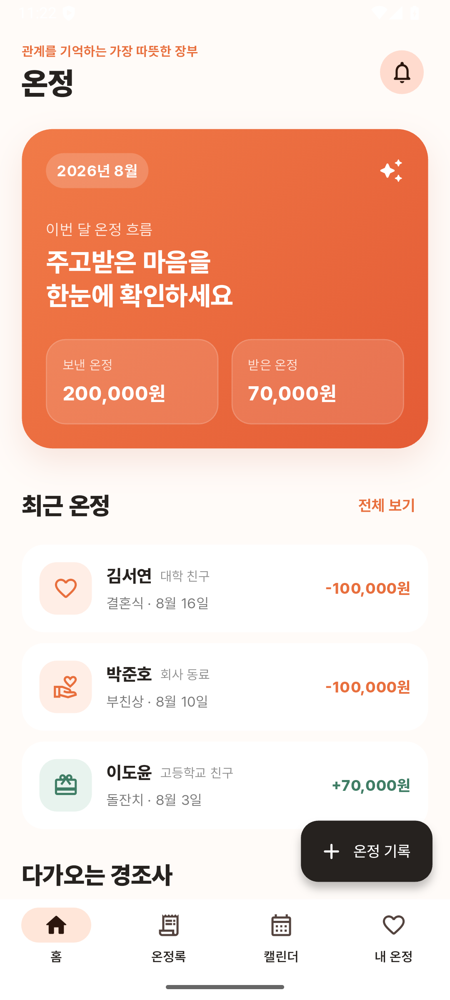
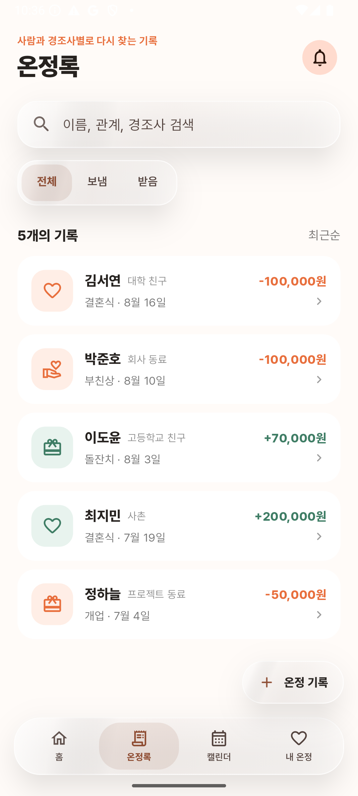
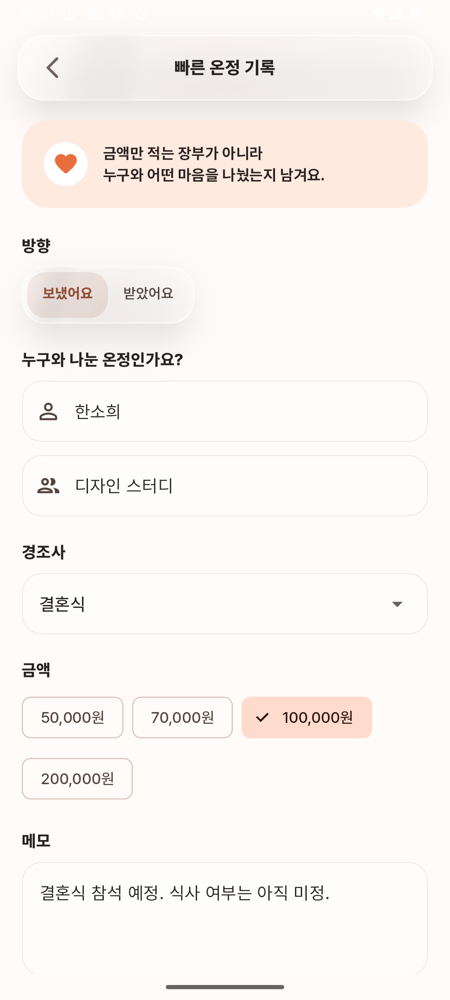
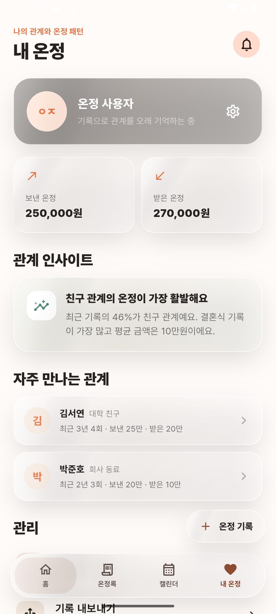

# Onjung · 온정

> **A relationship-first ledger for remembering the care exchanged around life events.**
> **경조사에서 주고받은 마음을 사람·관계·상황과 함께 기억하는 관계 중심 장부입니다.**

## About Onjung · 제품 소개

Onjung is a Flutter mobile app for recording and revisiting the money and care exchanged around weddings, funerals, first-birthday celebrations, birthdays, openings, and other important life events. Instead of treating each entry as a simple amount, it keeps the **relationship context**—who the person is, what happened, when it happened, and what you want to remember.

온정은 결혼식, 장례식, 돌잔치, 생일, 개업 등 경조사에서 오간 금액과 마음을 기록하고 다시 찾기 위한 Flutter 모바일 앱입니다. 단순한 금액 장부가 아니라 **누구와 어떤 관계인지, 어떤 경조사였는지, 언제 있었는지, 무엇을 기억할지**를 함께 남기는 것이 핵심입니다.

## Demo Runtime · 데모 실행 환경

The current `main` keeps the original product direction while providing a deterministic demo runtime, so the core mobile flow remains usable even when the legacy Firebase/backend environment is unavailable.

현재 `main`은 원래 제품 방향을 유지하면서 deterministic demo runtime을 제공해, 기존 Firebase/backend가 동작하지 않는 환경에서도 핵심 모바일 흐름을 바로 체험할 수 있습니다.

## Preview · 미리보기

<p align="center">
  
  
  
</p>

<p align="center">
  <strong>01 · Home / 홈</strong>
  &nbsp;&nbsp;|&nbsp;&nbsp;
  <strong>02 · Records / 온정록</strong>
  &nbsp;&nbsp;|&nbsp;&nbsp;
  <strong>03 · Record Detail / 온정 상세</strong>
</p>

<p align="center">
  
  
</p>

<p align="center">
  <strong>04 · Quick Record / 빠른 온정 기록</strong>
  &nbsp;&nbsp;|&nbsp;&nbsp;
  <strong>05 · My Onjung / 내 온정</strong>
</p>

## What it does · 주요 기능

- **Home summary / 홈 요약** — See this month's sent/received care and recent records at a glance. / 이번 달 보낸·받은 온정과 최근 기록을 한눈에 확인합니다.
- **Onjung records / 온정록** — Browse records by person, relationship, event, and date, with sent/received filtering. / 사람, 관계, 경조사, 날짜를 기준으로 기록을 탐색하고 보냄/받음을 구분합니다.
- **Record detail / 온정 상세** — Review the amount together with notes and relationship context. / 금액뿐 아니라 당시 메모와 관계 맥락을 함께 확인합니다.
- **Quick record / 빠른 기록** — Enter direction, person, relationship, event, amount, and memo in one flow, then update the list immediately. / 방향, 상대, 관계, 경조사, 금액, 메모를 한 흐름에서 입력하고 저장 즉시 목록에 반영합니다.
- **Calendar & My Onjung / 캘린더 & 내 온정** — Review date-based records, upcoming events, totals, and relationship insights. / 날짜별 기록, 다가오는 경조사, 보낸·받은 총액과 관계 인사이트를 확인합니다.
- **Deterministic demo fallback / 데모 fallback** — The core flow remains usable without Firebase or the legacy backend. / Firebase나 기존 backend가 없어도 핵심 모바일 흐름이 동작합니다.

## User flow · 사용자 흐름

`Home → Records → Record detail → Quick record → Save → Updated records → My Onjung / Calendar`

`홈 → 온정록 → 온정 상세 → 빠른 온정 기록 → 저장 → 갱신된 온정록 → 내 온정 / 캘린더`

## Architecture · 아키텍처

```text
lib/main.dart
  └─ ProviderScope
      └─ lib/portfolio/onjung_portfolio_app.dart
          ├─ Material 3 UI + navigation
          ├─ Riverpod StateNotifier
          └─ lib/portfolio/data/onjung_demo_repository.dart
              └─ deterministic domain sample data
```

The portfolio runtime is intentionally small: Flutter/Material UI, Riverpod state, and a deterministic repository provide the current runnable experience. The original `lib/core`, `lib/data`, `lib/features`, and `lib/shared` code remains in the repository and contains the earlier Firebase/Auth, SQLite, address-book, calendar, statistics, and guest-management implementation.

현재 portfolio runtime은 Flutter/Material UI, Riverpod 상태 관리, deterministic repository를 중심으로 작게 구성했습니다. 기존 `lib/core`, `lib/data`, `lib/features`, `lib/shared`에는 Firebase/Auth, SQLite, 주소록, 캘린더, 통계, 하객 관리 등 원래 앱의 구현이 보존되어 있습니다.

## Tech Stack · 기술 스택

- Flutter 3.27 / Dart 3.6
- Material 3 + Pretendard
- Riverpod (`StateNotifier`)
- `intl`
- Android API 35
- Original implementation / 기존 구현: GoRouter, Firebase Auth / Firestore / Remote Config, SQLite, Table Calendar, Flutter Map

## Run · 실행

```bash
flutter pub get
flutter run
```

The portfolio/demo flow does not require an API key or login account.
Portfolio/demo 흐름은 별도 API key나 로그인 계정 없이 실행할 수 있습니다.

## Product history · 제품 배경

Onjung began as a product for remembering the money and care exchanged in Korean life-event culture **through the context of relationships**, not as a marketplace or social network. This refresh keeps that original idea and turns it into a small mobile product that can still be run and explored today.

온정은 marketplace나 SNS가 아니라, 한국의 경조사 문화에서 오가는 금액과 마음을 **관계의 맥락으로 기억하기 위한 앱**으로 시작했습니다. 이번 정리는 그 목적을 바꾸지 않고 기존 아이디어를 지금도 실행하고 탐색할 수 있는 작은 모바일 제품으로 마무리한 작업입니다.

## Topics

[`dart`](https://github.com/topics/dart) · [`event-ledger`](https://github.com/topics/event-ledger) · [`firebase`](https://github.com/topics/firebase) · [`flutter`](https://github.com/topics/flutter) · [`go-router`](https://github.com/topics/go-router) · [`mobile-app`](https://github.com/topics/mobile-app) · [`riverpod`](https://github.com/topics/riverpod) · [`sqflite`](https://github.com/topics/sqflite) · [`ledger`](https://github.com/topics/ledger) · [`mobile-development`](https://github.com/topics/mobile-development) · [`state-management`](https://github.com/topics/state-management) · [`local-database`](https://github.com/topics/local-database) · [`flutter-app`](https://github.com/topics/flutter-app) · [`cross-platform`](https://github.com/topics/cross-platform) · [`flutter-development`](https://github.com/topics/flutter-development) · [`personal-finance`](https://github.com/topics/personal-finance)
